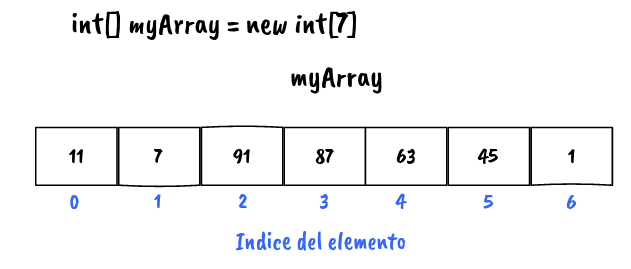
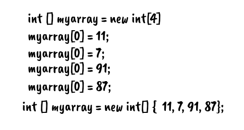
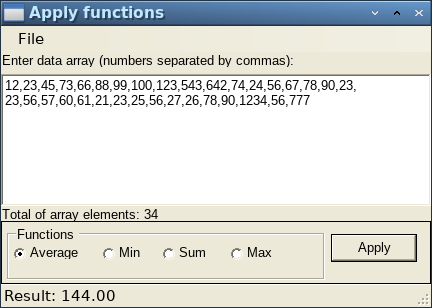
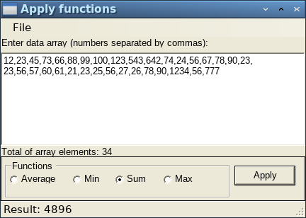

# Arreglos unidimensionales en C#

Un arreglo es un grupo de variables o elementos del mismo tipo que contienen valores. Los arreglos son tipos por referencia. Los elementos de un arreglo pueden ser tipos por valor, otros arreglos o tipos por referencia, para referirse a un elemento en especial en un arreglo, especificamos el nombre de la referencia al arreglo y el número de la posición de ese elemento en el arreglo. A la posición se le conoce como el índice del elemento.

Una aplicación hace referencia a cualquiera de estos elementos mediante una expresión de acceso a un arreglo, la cual incluye el nombre del arreglo, seguido del índice del elemento especifico entre corchetes ([]). El primer elemento en cualquier arreglo tiene el índice cero.

Fig 1. Estructura de un arreglo

Un índice debe ser un entero no negativo; también puede ser una expresión. El índice del arreglo debe ser un valor de tipo int, uint, long o ulong. o un valor de un tipo que pueda promoverse en forma implícita a uno de estos tipos.

Cada instancia de un arreglo conoce su propia longitud y proporciona acceso a esta información a través de la propiedad Length esta propiedad es de solo lectura y no puede cambiarse.

Declaración de arreglos
Las instancias de los arreglos ocupan espacio en memoria. Al igual que los objetos, los arreglos se crean con la palabra reservada new. Para crear una instancia de un arreglo, se especifica el tipo y el número de elementos del arreglo, y el número de elementos como parte de la expresión. Dicha expresión devuelve una referencia que puede almacenarse en una variable tipo arreglo.

Fig 2. Declaración de arreglos

La siguiente aplicación nos muestra cómo crear un arreglo de los elementos que recibe separados por comas, también aplica las siguientes operaciones promedio (AVG), mínimo (MIN), máximo (MAX) y la suma (SUM) al conjunto de elementos.

Fig 3. Aplicando la función promedio (AVG) a un arreglo

Fig 4. Aplicando la función suma (SUM) a un arreglo

